# Site Index Models

## Site index models included in the package

### `si_buckman2006()`

- Function reference:
  [`si_buckman2006()`](https://ptompalski.github.io/CanadaForestAllometry/reference/si_buckman2006.md)
- Description: Buckman et al. (2006) piecewise red pine site-index model
  Buckmann et al. ([2006](#ref-Buckman2006))
- Age type: Total age
- Coverage: ON
- Species coverage: PINU.RES

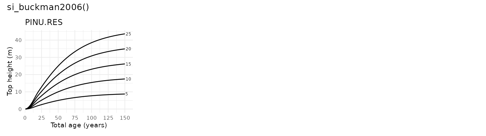

### `si_carmean1989()`

- Function reference:
  [`si_carmean1989()`](https://ptompalski.github.io/CanadaForestAllometry/reference/si_carmean1989.md)
- Description: Carmean et al. (1989) eastern species site-index model
  set Carmean et al. ([1989](#ref-Carmean1989))
- Age type: Total age
- Coverage: NB, NL, NS, ON, PE, QC
- Species coverage: ACER.SAC, BETU.ALL, CHAM.THY, FAGU.GRA, FRAX.AME,
  FRAX.NIG, PRUN.SER, QUER.RUB, TILI.AME, TSUG.CAN, ULMU.AME

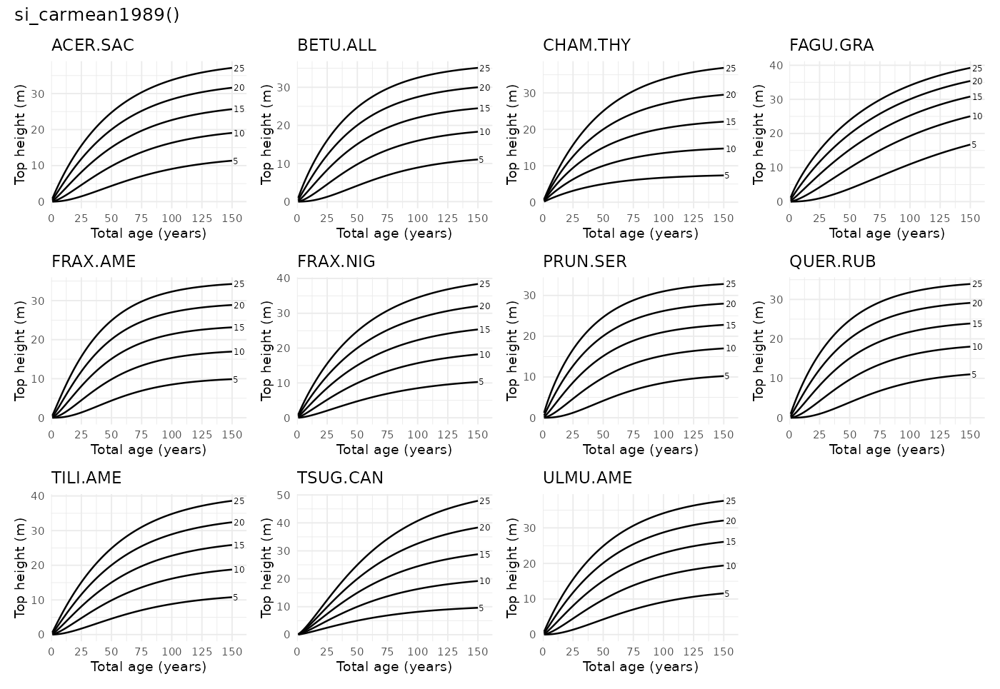

### `si_carmean1996()`

- Function reference:
  [`si_carmean1996()`](https://ptompalski.github.io/CanadaForestAllometry/reference/si_carmean1996.md)
- Description: Carmean (1996) northwest Ontario site-index model set
  Carmean ([1996](#ref-Carmean1996))
- Age type: Breast-height age
- Coverage: ON
- Species coverage: ABIE.BAL, BETU.PAP, LARI.LAR, PICE.GLA, PICE.MAR,
  PINU.BAN, POPU.TRE

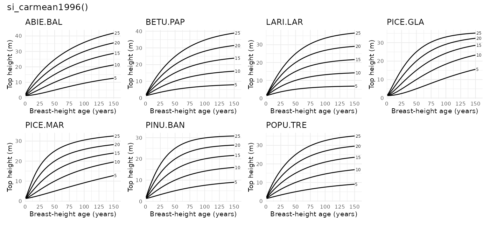

### `si_carmeanhahn1981()`

- Function reference:
  [`si_carmeanhahn1981()`](https://ptompalski.github.io/CanadaForestAllometry/reference/si_carmeanhahn1981.md)
- Description: Lake States site-index model for balsam fir and white
  spruce Carmean and Hahn ([1981](#ref-CarmeanHahn1981))
- Age type: Total age
- Coverage: ON
- Species coverage: ABIE.BAL, PICE.GLA

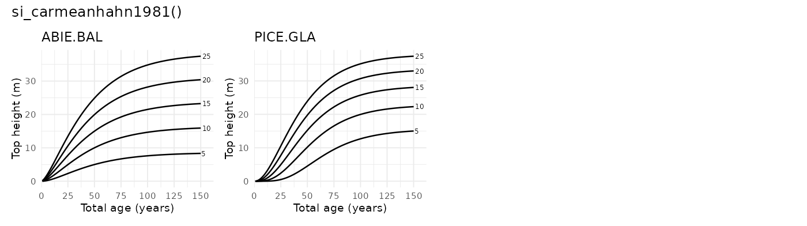

### `si_cieszewskibella1991()`

- Function reference:
  [`si_cieszewskibella1991()`](https://ptompalski.github.io/CanadaForestAllometry/reference/si_cieszewskibella1991.md)
- Description: Alberta polymorphic variable-age site-index model for
  four major tree species Cieszewski and Bella
  ([1991](#ref-CieszewskiBella1991))
- Age type: Breast-height age
- Coverage: AB
- Species coverage: PICE.GLA, PICE.MAR, PINU.CON, POPU.TRE

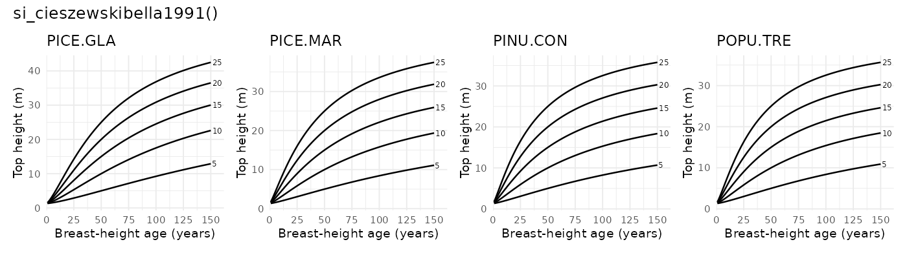

### `si_huang1994()`

- Function reference:
  [`si_huang1994()`](https://ptompalski.github.io/CanadaForestAllometry/reference/si_huang1994.md)
- Description: Huang et al. (1994) Alberta polymorphic site-index model
  set Huang et al. ([1994](#ref-Huang1994si))
- Age type: Breast-height age
- Coverage: AB
- Species coverage: ABIE.BAL, PICE.GLA, PICE.MAR, PINU.BAN, PINU.CON,
  POPU.BAL, POPU.TRE, PSEU.MEN

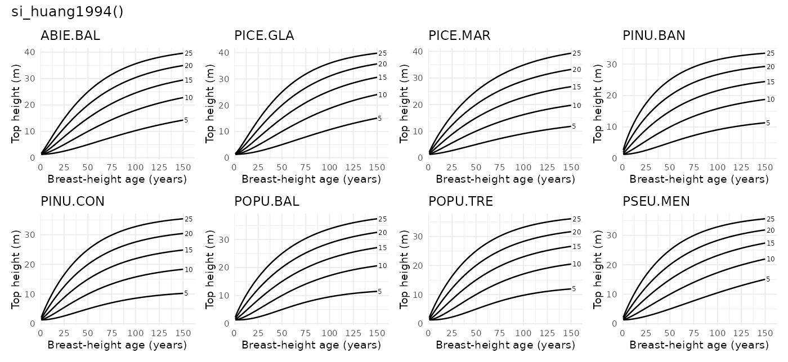

### `si_kerbowling1991()`

- Function reference:
  [`si_kerbowling1991()`](https://ptompalski.github.io/CanadaForestAllometry/reference/si_kerbowling1991.md)
- Description: New Brunswick polymorphic site-index model for softwoods
  Ker and Bowling ([1991](#ref-KerBowling1991))
- Age type: Breast-height age
- Coverage: NB
- Species coverage: ABIE.BAL, PICE.GLA, PICE.MAR, PINU.BAN

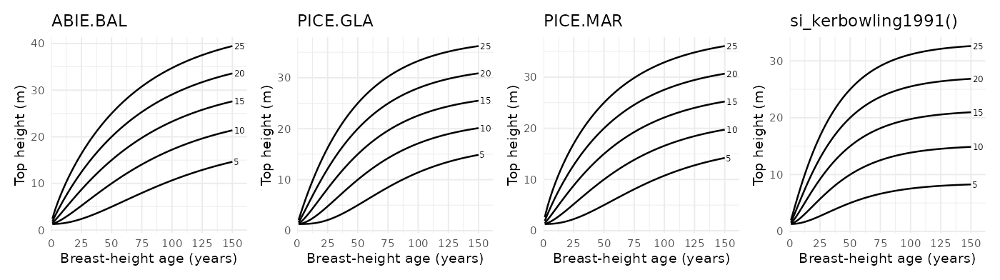

### `si_lundgrendolid1970()`

- Function reference:
  [`si_lundgrendolid1970()`](https://ptompalski.github.io/CanadaForestAllometry/reference/si_lundgrendolid1970.md)
- Description: Lundgren and Dolid model (exponential monomolecular form)
  Lundgren and Dolid ([1970](#ref-LundgrenDolid1970))
- Age type: Breast-height age
- Coverage: ON
- Species coverage: ABIE.BAL, BETU.PAP, LARI.LAR, PICE.GLA, PICE.MAR,
  PINU.BAN, PINU.RES, PINU.STR, POPU.TRE, QUER.RUB, THUJ.OCC

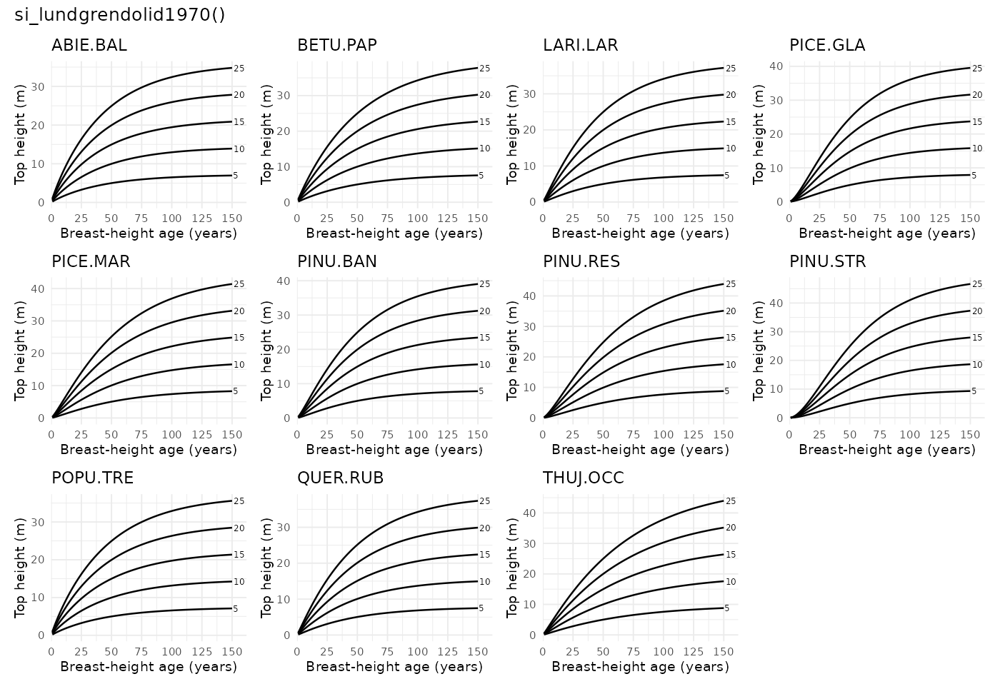

### `si_nigh2000()`

- Function reference:
  [`si_nigh2000()`](https://ptompalski.github.io/CanadaForestAllometry/reference/si_nigh2000.md)
- Description: Nigh (2000) polymorphic site-index model for interior
  western redcedar Nigh ([2000](#ref-Nigh2000))
- Age type: Breast-height age
- Coverage: BC
- Species coverage: THUJ.PLI

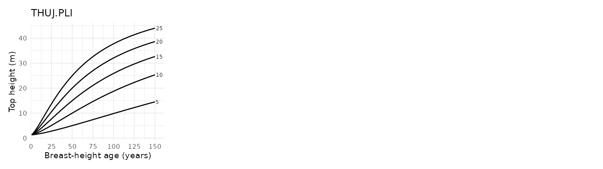

### `si_nigh2000_gi()`

- Function reference:
  [`si_nigh2000_gi()`](https://ptompalski.github.io/CanadaForestAllometry/reference/si_nigh2000_gi.md)
- Description: Nigh (2000) growth-intercept site-index model for
  interior western redcedar Nigh ([2000](#ref-Nigh2000))
- Age type: Breast-height age
- Coverage: BC
- Species coverage: THUJ.PLI

*No curve graphic shown for growth-intercept model.*

### `si_nighcourtin1998()`

- Function reference:
  [`si_nighcourtin1998()`](https://ptompalski.github.io/CanadaForestAllometry/reference/si_nighcourtin1998.md)
- Description: Nigh and Courtin (1998) red alder model, SI25 scale Nigh
  and Courtin ([1998](#ref-NighCourtin1998))
- Age type: Breast-height age
- Coverage: BC
- Species coverage: ALNU.RUB

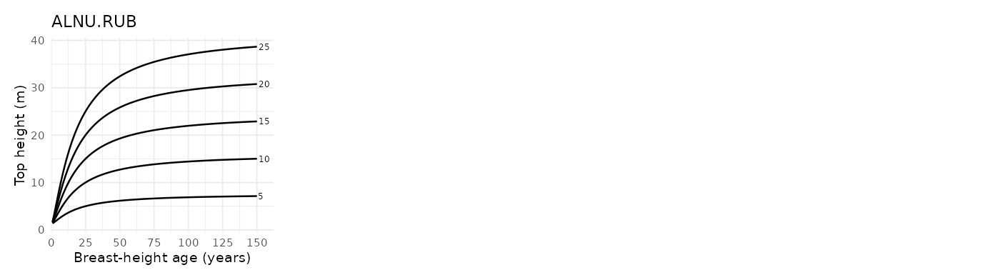

### `si_parresolvissage1998()`

- Function reference:
  [`si_parresolvissage1998()`](https://ptompalski.github.io/CanadaForestAllometry/reference/si_parresolvissage1998.md)
- Description: Parresol and Vissage (1998) base-age invariant eastern
  white pine model Parresol and Vissage
  ([1998](#ref-ParresolVissage1998))
- Age type: Breast-height age
- Coverage: NB, NL, NS, ON, PE, QC
- Species coverage: PINU.STR

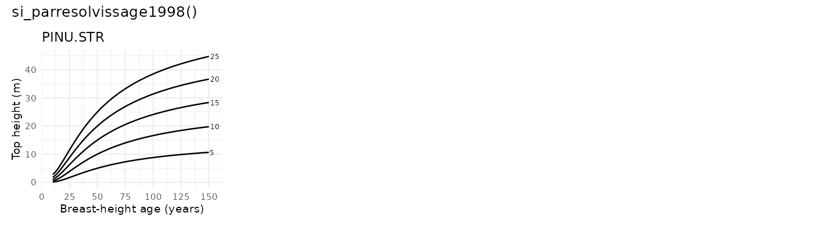

### `si_payandeh1974()`

- Function reference:
  [`si_payandeh1974()`](https://ptompalski.github.io/CanadaForestAllometry/reference/si_payandeh1974.md)
- Description: Payandeh (1974) nonlinear site-index equations Payandeh
  ([1974](#ref-Payandeh1974))
- Age type: Breast-height age
- Coverage: Canada (all provinces/territories)
- Species coverage: ABIE.BAL, PICE.GLA, PICE.RUB, PICE.SIT, PINU.CON,
  PINU.MON, PINU.PON, PSEU.MEN, TSUG.HET

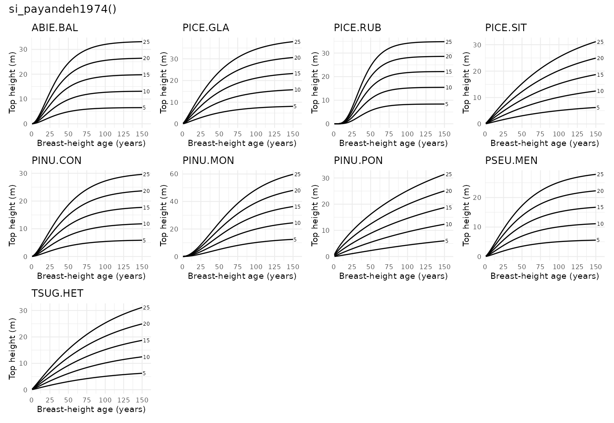

### `si_scottvoorhis1986()`

- Function reference:
  [`si_scottvoorhis1986()`](https://ptompalski.github.io/CanadaForestAllometry/reference/si_scottvoorhis1986.md)
- Description: Scott and Voorhis (1986) model using breast-height age
  directly Scott and Voorhis ([1986](#ref-ScottVoorhis1986))
- Age type: Breast-height age
- Coverage: NB, NL, NS, ON, PE, QC
- Species coverage: ABIE.BAL, ACER.SAC, BETU.ALL, BETU.PAP, FRAX.AME,
  LIQU.STY, LIRI.TUL, PICE.GLA, PICE.MAR, PICE.RUB, PINU.BAN, PINU.ECH,
  PINU.RES, PINU.STR, PINU.TAE, PINU.VIR, POPU.GRA, QUER.ALB, THUJ.OCC

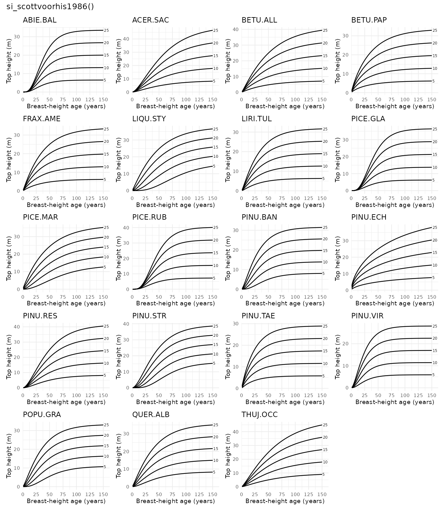

### `si_sharma2015()`

- Function reference:
  [`si_sharma2015()`](https://ptompalski.github.io/CanadaForestAllometry/reference/si_sharma2015.md)
- Description: Sharma et al. (2015) no-climate plantation model for jack
  pine and black spruce Sharma et al. ([2015](#ref-SharmaEtAl2015))
- Age type: Breast-height age
- Coverage: ON
- Species coverage: PICE.MAR, PINU.BAN

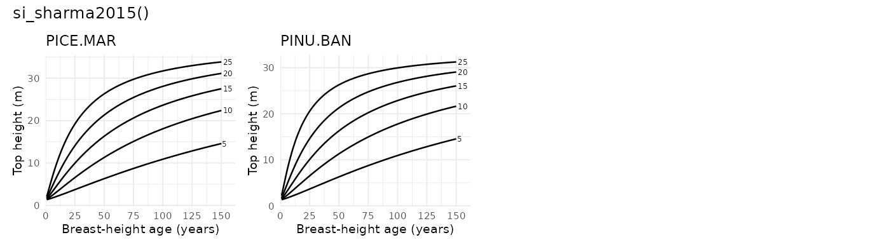

### `si_sharma2021()`

- Function reference:
  [`si_sharma2021()`](https://ptompalski.github.io/CanadaForestAllometry/reference/si_sharma2021.md)
- Description: Sharma (2021) fixed-effects no-climate mixed-stand
  site-index model Sharma ([2021](#ref-Sharma2021SI))
- Age type: Breast-height age
- Coverage: ON
- Species coverage: PICE.MAR, PINU.BAN

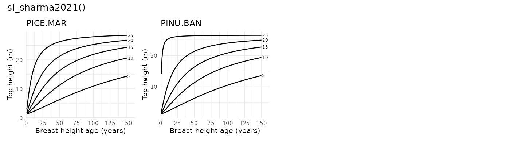

### `si_sharma2022()`

- Function reference:
  [`si_sharma2022()`](https://ptompalski.github.io/CanadaForestAllometry/reference/si_sharma2022.md)
- Description: Sharma (2022) fixed-effects no-climate mixed-stand
  site-index model Sharma ([2022](#ref-Sharma2022))
- Age type: Breast-height age
- Coverage: ON
- Species coverage: PICE.MAR, POPU.TRE

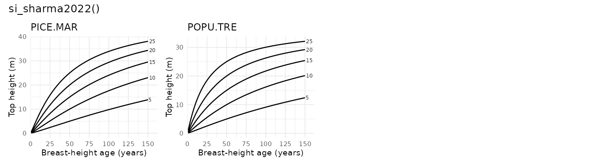

### `si_sharmaparton2018a()`

- Function reference:
  [`si_sharmaparton2018a()`](https://ptompalski.github.io/CanadaForestAllometry/reference/si_sharmaparton2018a.md)
- Description: Sharma and Parton (2018) non-climate white spruce
  plantation model Sharma and Parton ([2018a](#ref-SharmaParton2018a))
- Age type: Breast-height age
- Coverage: ON
- Species coverage: PICE.GLA

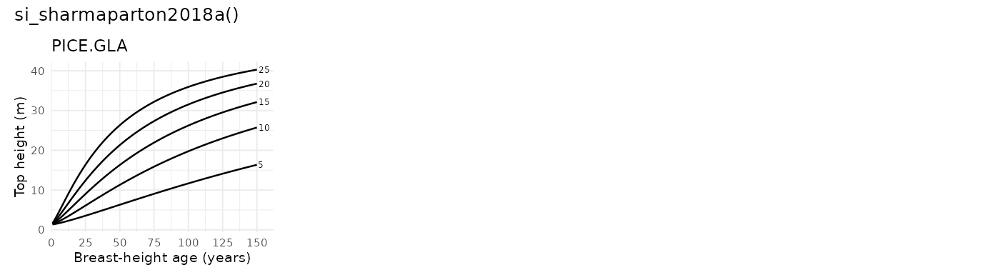

### `si_sharmaparton2018b()`

- Function reference:
  [`si_sharmaparton2018b()`](https://ptompalski.github.io/CanadaForestAllometry/reference/si_sharmaparton2018b.md)
- Description: Sharma and Parton (2018) non-climate red pine plantation
  model Sharma and Parton ([2018b](#ref-SharmaParton2018b))
- Age type: Breast-height age
- Coverage: ON
- Species coverage: PINU.RES

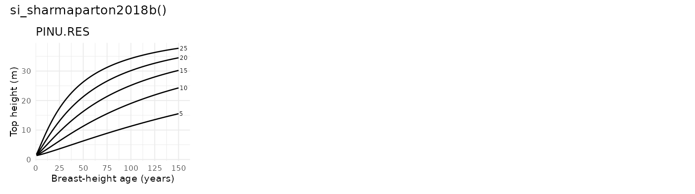

### `si_sharmaparton2019()`

- Function reference:
  [`si_sharmaparton2019()`](https://ptompalski.github.io/CanadaForestAllometry/reference/si_sharmaparton2019.md)
- Description: Sharma and Parton (2019) non-climate white pine
  plantation model Sharma and Parton ([2019](#ref-SharmaParton2019))
- Age type: Breast-height age
- Coverage: ON
- Species coverage: PINU.STR

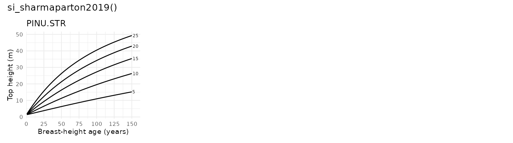

### `si_sharmareid2018()`

- Function reference:
  [`si_sharmareid2018()`](https://ptompalski.github.io/CanadaForestAllometry/reference/si_sharmareid2018.md)
- Description: Sharma and Reid (2018) fixed-effects natural-stand
  site-index model Sharma and Reid ([2018](#ref-SharmaReid2018))
- Age type: Breast-height age
- Coverage: ON
- Species coverage: PICE.MAR, PINU.BAN

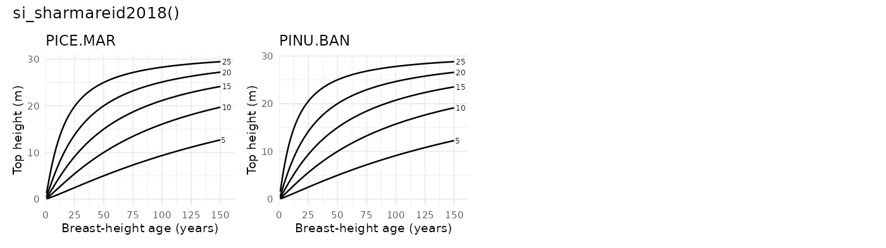

### `si_thrower1994()`

- Function reference:
  [`si_thrower1994()`](https://ptompalski.github.io/CanadaForestAllometry/reference/si_thrower1994.md)
- Description: Thrower et al. (1994) BC interior species model set
  Thrower et al. ([1994](#ref-Thrower1994))
- Age type: Breast-height age
- Coverage: BC
- Species coverage: ABIE.LAS, BETU.PAP, LARI.OCC, PICE.GLA, PINU.CON,
  PINU.MON, PINU.PON, POPU.TRE, PSEU.MEN, THUJ.PLI, TSUG.HET

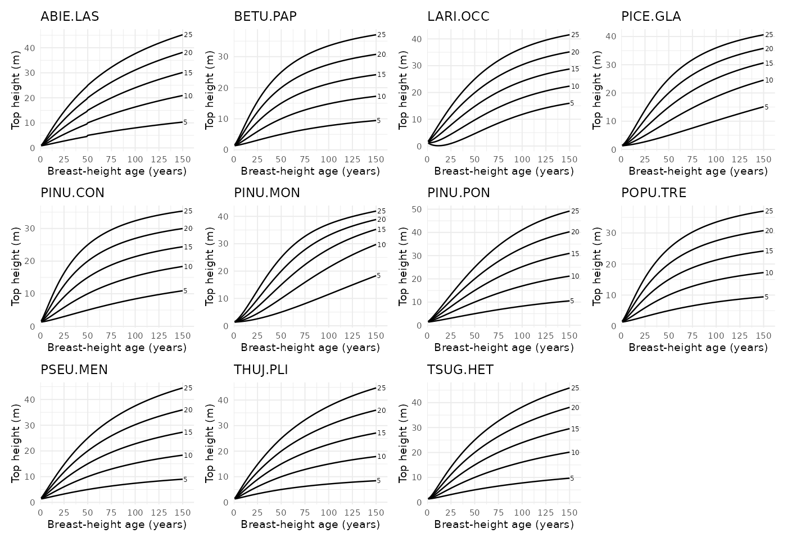

## References

Buckmann, R.E., Bishaw, B., Hanson, T.J., Benford, F.A., 2006. Growth
and yield of red pine in the lake states (No. NC-271), General technical
report. U.S. Department of Agriculture, Forest Service.

Carmean, W.H., 1996. Site-quality evaluation, site-quality maintenance,
and site-specific management for forest land in northwest ontario (No.
TR-105), NWST technical report. Ontario Ministry of Natural Resources,
Northwest Science; Technology, Thunder Bay, Ontario.

Carmean, W.H., Hahn, J.T., 1981. Revised Site Index Curves for Balsam
Fir and White Spruce in the Lake States. Research Note NC-269. St. Paul,
MN: U.S. Dept. of Agriculture, Forest Service, North Central Forest
Experiment Station 269. <https://doi.org/10.2737/NC-RN-269>

Carmean, W.H., Hahn, J.T., Jacobs, R.D., 1989. Site index curves for
forest tree species in the eastern united states (No. NC-128), General
technical report. U.S. Department of Agriculture, Forest Service, North
Central Forest Experiment Station.

Cieszewski, C.J., Bella, I.E., 1991. Polymorphic height and site index
curves for the major tree species in alberta (No. 51), Forest management
note. Forestry Canada, Northwest Region, Northern Forestry Centre,
Edmonton, Alberta.

Huang, S., Titus, S.J., Lakusta, T.W., 1994. Ecologically based site
index curves and tables for major Alberta tree species. Tech. Report No.
T307.

Ker, M.F., Bowling, C., 1991. Polymorphic site index equations for four
New Brunswick softwood species. Canadian Journal of Forest Research 21,
728–732. <https://doi.org/10.1139/x91-103>

Lundgren, A.L., Dolid, W.A., 1970. Biological growth functions describe
published site index curves for Lake States timber species. Research
Paper NC-36. St. Paul, MN: U.S. Dept. of Agriculture, Forest Service,
North Central Forest Experiment Station 36.

Nigh, G.D., 2000. Western redcedar site index models for the interior of
British Columbia (No. Rep. 18). BC Ministry of Forests, Research Branch,
Victoria, B.C.

Nigh, G.D., Courtin, P.J., 1998. Height models for Red Alder (Alnus
rubra Bong.) in British Columbia. New Forests 16, 59–70.
<https://doi.org/10.1023/A:1006561502635>

Parresol, B.R., Vissage, J.S., 1998. White pine site index for the
southern forest survey (No. Research Paper SRS-10). U.S. Department of
Agriculture, Forest Service, Southern Research Station, Asheville, NC.

Payandeh, B., 1974. Nonlinear site index equations for several major
Canadian timber species. The Forestry Chronicle 50, 194–196.
<https://doi.org/10.5558/tfc50194-5>

Scott, C.T., Voorhis, N.G., 1986. Northeastern Forest Survey Site Index
Equations and Site Productivity Classes. Northern Journal of Applied
Forestry 3, 144–148. <https://doi.org/10.1093/njaf/3.4.144>

Sharma, M., 2022. Climate effects on black spruce and trembling aspen
productivity in natural origin mixed stands. Forests 13, 430.
<https://doi.org/10.3390/f13030430>

Sharma, M., 2021. Climate effects on jack pine and black spruce
productivity in natural origin mixed stands and site index conversion
equations. Trees, Forests and People 5, 100089.
<https://doi.org/10.1016/j.tfp.2021.100089>

Sharma, M., Parton, J., 2019. Modelling the effects of climate on site
productivity of white pine plantations. Canadian Journal of Forest
Research 49, 1289–1297. <https://doi.org/10.1139/cjfr-2019-0165>

Sharma, M., Parton, J., 2018a. Analyzing and modelling effects of
climate on site productivity of white spruce plantations. The Forestry
Chronicle 94, 173–182.

Sharma, M., Parton, J., 2018b. Climatic effects on site productivity of
red pine plantations. Forest Science 64, 544–554.

Sharma, M., Reid, D.E.B., 2018. Stand height/site index equations for
jack pine and black spruce trees grown in natural stands. Forest Science
64, 33–40. <https://doi.org/10.5849/FS-2016-133>

Sharma, M., Subedi, N., Ter-Mikaelian, M., Parton, J., 2015. Modeling
climatic effects on stand height/site index of plantation-grown jack
pine and black spruce trees. Forest Science 61, 25–34.
<https://doi.org/10.5849/forsci.13-190>

Thrower, J.S., Nussbaum, A.F., Di Lucca, C.M., 1994. Site index curves
and tables for british columbia: Interior species (No. Field Guide
Insert 6), Land management handbook. B.C. Ministry of Forests.
